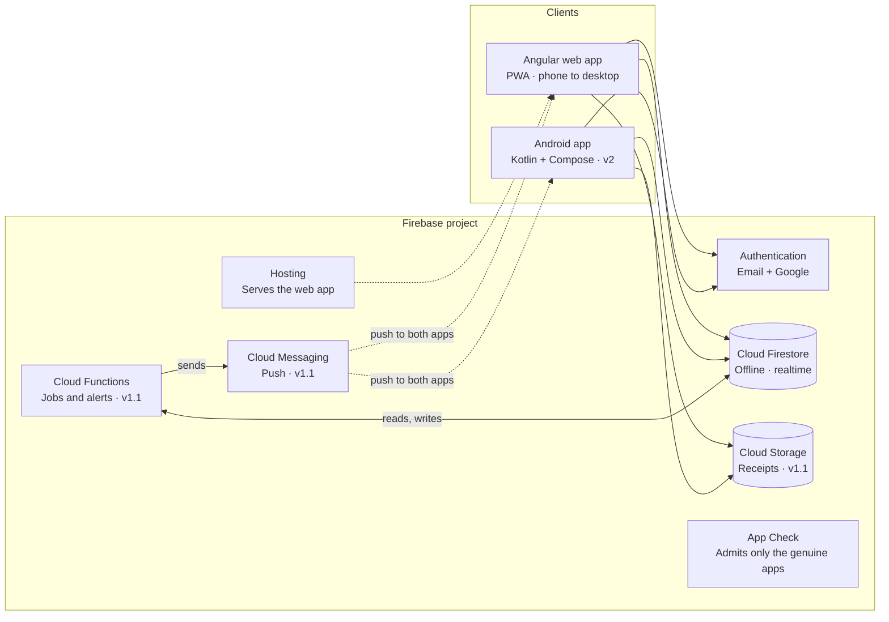

# Expense Tracker — Functional Requirements & Technical Documentation

Sep 26, 2026 · Sandip

## 1. Overview

A personal tracker for income, expenses and transfers. An Angular web app ships first (responsive and installable as a PWA); a native Kotlin Android app follows on the same Firebase backend. Logging a transaction should take under 5 seconds, and the dashboard answers three questions: where did my money go, am I within budget, and am I saving more than last month?

Both apps read and write the same Firestore data, so the business rules (section 4) and data model (section 8) are a contract, not just notes.

### Goals

| Goal | Measure | Target |
| --- | --- | --- |
| Fast entry | Median time from tapping + to saved | Under 5 s |
| Trustworthy numbers | App balances match real bank and cash balances | Any gap fixed in one reconcile step |
| Instant insight | "Spent vs budget this month" on a phone without scrolling | First screen |
| Fast load | Dashboard ready on a mid-range phone over 4G | Under 2.5 s |
| Low running cost | Firebase usage for personal use | Within no-cost quotas |

### Scope

**In scope:** phase 1 web app for phone, tablet and desktop browsers; phase 2 Android app (Android 8.0+); Firebase Authentication, Cloud Firestore, Cloud Storage, Cloud Functions, Cloud Messaging and Hosting.

**Out of scope:** automatic bank syncing, investment and crypto tracking, business accounting (invoices, tax filing) and a native iOS app. iPhone users install the PWA instead.

### Users

| Persona | Main need | Features that serve it |
| --- | --- | --- |
| Salaried professional | Stay within a monthly budget; salary may not arrive on the 1st | Budgets, custom month start day, recurring salary and rent |
| Freelancer | Track irregular income; separate business and personal money | Multiple accounts, income categories, period reports |
| Student | Make a small allowance last; mostly cash and mobile wallet | Quick add, cash and wallet accounts, daily reminder |
| Admin (the person who deploys it) | Keep a private deployment private: decide who may use the app | Users page: approve, disable, admin role (section 3.16) |
| Household (future) | Share a wallet and budget with a partner | Shared wallets with roles |

### Glossary

| Term | Meaning |
| --- | --- |
| Account (wallet) | Where money sits: cash, bank, credit card, mobile wallet, savings or loan |
| Transaction | One money movement: income, expense or transfer |
| Transfer | Money moved between two of the user's own accounts; neither income nor expense |
| Category | What money was spent on or earned from; typed as income or expense |
| Budget | A spending limit for a period, for all expenses or for chosen categories |
| Recurring rule | A transaction template plus a schedule (salary, rent, subscriptions) |
| Period | The date range budgets and reports use; a month can start on any day 1–28 |
| Minor units | Money stored as an integer of the currency's smallest unit (12.50 → 1250) |
| Base currency | The user's main currency for totals and reports |
| Admin | A user with role admin who manages who can use the app; admins never see other users' money data |
| Access status | pending, active or disabled on each profile; only active users can read or write their data |

## 2. What's in the app

The MVP has 13 modules, enough to replace a spreadsheet. v1.1 adds automation (recurring entries, receipts, import, alerts), v2 is the Android app, and the rest waits in the backlog.

| Module | What it covers | First release |
| --- | --- | --- |
| Authentication and profile | Email/password and Google sign-in, password reset, profile, account deletion | MVP |
| Onboarding | Base currency, first account, default categories | MVP |
| Accounts | Cash, bank, credit card, mobile wallet, savings and loan accounts with live balances | MVP |
| Transactions | Add, edit, delete and duplicate income, expenses and transfers; payee, note, tags | MVP |
| Categories | Default and custom categories with icons, colors and subcategories | MVP |
| Transaction list and search | Day-grouped history, filters, search, period totals | MVP |
| Dashboard | Period summary, balances, spending by category, 6-month trend | MVP |
| Budgets | Monthly limits overall or per category, with progress states | MVP |
| Reports | Category breakdown now; trends and period comparison in v1.1 | MVP |
| Settings | Currency, month start day, theme, data and privacy | MVP |
| Export | CSV export for any period | MVP |
| Offline and sync | Works offline; real-time sync across devices | MVP |
| Admin and access | Approve, disable and re-enable users and assign the admin role; new sign-ups wait for approval | MVP |
| Recurring transactions | Salary, rent and subscriptions on a schedule | v1.1 |
| Receipts | Photo or PDF attachments per transaction | v1.1 |
| Import and backup | CSV import with column mapping; JSON backup | v1.1 |
| Notifications | Daily reminder, budget alerts, bill reminders | v1.1 |
| Android app | Native Kotlin app at parity with web, plus widget and biometric lock | v2 (Android) |
| Savings goals | Target amount and date with progress | Future |
| Multi-currency | Accounts in different currencies, converted to base currency | Future |
| Shared wallets | Household members share accounts and budgets | Future |

## 3. Functional requirements

Requirements are numbered per module (AUTH-01…) so tickets, tests and both codebases can point to them. Priority: **Must** = MVP, **Should** = v1.1, **Could** = later.

### 3.1 Authentication and profile

| ID | Requirement | Priority |
| --- | --- | --- |
| AUTH-01 | Register with email and password (minimum 8 characters, with a strength hint). | Must |
| AUTH-02 | Don't require email verification and send no verification email. A new account can use the app once an admin approves it (ADM-02) or its email was invited (ADM-08). Show the email on the profile so a typo is easy to spot, since password resets go there. | Must |
| AUTH-03 | Sign in with Google. | Must |
| AUTH-04 | Reset a forgotten password through an emailed link. | Must |
| AUTH-05 | Keep the session across restarts until the user signs out. | Must |
| AUTH-06 | Send signed-out users from protected pages to login, then back to the page they asked for. | Must |
| AUTH-07 | Delete the account and all its data after re-authentication and typing DELETE (Google Play also requires this for the Android app). | Must |
| AUTH-08 | Edit display name and profile photo. | Should |
| AUTH-09 | Change password (email users), with re-authentication. | Should |
| AUTH-10 | Link Google and email sign-in to one account. | Could |

### 3.2 Onboarding

| ID | Requirement | Priority |
| --- | --- | --- |
| ONB-01 | On first sign-in, run three skippable steps: base currency (preselected from the browser locale) → first account (default "Cash", opening balance 0) → review default categories. | Must |
| ONB-02 | Seed the default income and expense categories in Appendix A. | Must |
| ONB-03 | Seed with fixed IDs (such as `exp_food`) so re-running on web or Android never duplicates categories. | Must |
| ONB-04 | Save `onboardingCompleted` on the profile and skip onboarding afterwards. | Must |

### 3.3 Accounts

| ID | Requirement | Priority |
| --- | --- | --- |
| ACC-01 | Create an account with name, type (cash, bank, credit card, mobile wallet, savings, loan, other), opening balance, icon and color. | Must |
| ACC-02 | Show each account's current balance and a total of accounts marked "include in total". | Must |
| ACC-03 | Edit an account; changing the opening balance shifts the current balance by the difference. | Must |
| ACC-04 | Archive an account: hidden from pickers and the dashboard, history kept, restorable; warn if the balance isn't zero. | Must |
| ACC-05 | Delete an account only when it has no transactions, or after confirming deletion of all of them. | Should |
| ACC-06 | Show an account page with its transactions and running balance. | Should |
| ACC-07 | Reconcile: the user enters the real balance and the app records a "Balance adjustment" for the difference. | Should |
| ACC-08 | Show credit card and loan balances as amounts owed, with optional credit limit and utilization. | Should |
| ACC-09 | Reorder accounts by drag and drop. | Could |

### 3.4 Categories

| ID | Requirement | Priority |
| --- | --- | --- |
| CAT-01 | Keep separate category lists for expense and income. | Must |
| CAT-02 | Create and rename categories and change their icon and color. | Must |
| CAT-03 | Archive a category: hidden from pickers; existing transactions keep it. | Must |
| CAT-04 | Keep names unique per type and parent, ignoring case. | Must |
| CAT-05 | Provide non-deletable "Uncategorized" and "Balance adjustment" categories for each type. | Must |
| CAT-06 | Delete an unused category; a used one needs a replacement first, and its transactions and budgets are reassigned. | Must |
| CAT-07 | Support one level of subcategories (Food › Groceries); reports roll them up to the parent. | Should |
| CAT-08 | Reorder categories; show the most-used first in pickers. | Could |

### 3.5 Transactions

| ID | Requirement | Priority |
| --- | --- | --- |
| TXN-01 | Add a transaction of type expense, income or transfer. | Must |
| TXN-02 | Require amount (> 0), account and date; require a category for income and expense, and a different destination account for transfers. | Must |
| TXN-03 | Offer optional time, payee (≤ 100 characters), note (≤ 500) and tags (≤ 10). | Must |
| TXN-04 | Prefill new entries with expense, today's date and the last-used account. | Must |
| TXN-05 | Open quick add from every screen: a + button on mobile; a button and the N shortcut on desktop. | Must |
| TXN-06 | Edit any field; every affected account balance updates, including when type or account changes. | Must |
| TXN-07 | Delete with a 5-second Undo. | Must |
| TXN-08 | Show the new balance instantly after saving, online or offline (section 4). | Must |
| TXN-09 | Exclude transfers from income, expense, category and budget totals. | Must |
| TXN-10 | Offer "Save and add another" for logging several entries in a row. | Should |
| TXN-11 | Duplicate a transaction into a prefilled form dated today. | Should |
| TXN-12 | Autocomplete payees and tags from past entries. | Should |
| TXN-13 | Bulk select to delete, recategorize or move to another account. | Should |
| TXN-14 | Label future-dated transactions "Upcoming". | Should |
| TXN-15 | Suggest a category from the payee's last-used category. | Could |
| TXN-16 | Accept simple arithmetic in the amount field (120+45). | Could |
| TXN-17 | Record an optional transfer fee as a linked expense. | Could |

### 3.6 Transaction list, search and filter

| ID | Requirement | Priority |
| --- | --- | --- |
| LST-01 | List transactions newest first, grouped by day with each day's net. | Must |
| LST-02 | Filter by period (this month, last month, this year, custom), type, accounts and categories; filters combine. | Must |
| LST-03 | Show income, expense and net totals for the filtered result. | Must |
| LST-04 | Keep lists of 1,000+ rows smooth with virtual scrolling; load periods longer than a year in pages. | Must |
| LST-05 | Show an empty state with a clear next action. | Must |
| LST-06 | Search payee, note and tags within the loaded period. | Should |
| LST-07 | Filter by tags and amount range. | Should |
| LST-08 | Search across all time. | Could |

### 3.7 Dashboard

The dashboard is the default screen after sign-in. It answers the three questions from section 1 for one period at a time: where did my money go, am I within budget, and am I saving more than last period? Every figure on it comes from the rules in section 4, so the Android dashboard shows the same numbers.

| ID | Requirement | Priority |
| --- | --- | --- |
| DSH-01 | Show income, expense, net and savings rate for the selected period. | Must |
| DSH-02 | Show the total balance and each account's balance. | Must |
| DSH-03 | Chart spending by category (donut); selecting a slice opens the filtered list. | Must |
| DSH-04 | Chart income vs expense for the last 6 periods. | Must |
| DSH-05 | Show the 5 most recent transactions. | Must |
| DSH-06 | Switch period (this month, last month, custom), respecting the month start day. | Must |
| DSH-07 | Show progress of active budgets. | Must |
| DSH-08 | List recurring transactions due in the next 7 days. | Should |
| DSH-09 | Privacy mode: one tap masks all amounts. | Could |
| DSH-10 | Show the change from the previous period on each summary card, as amount and %, with an up or down icon and a sign, never color alone. | Must |
| DSH-11 | Make every card a way in: summary cards and donut slices open the transaction list with that filter, balances open Accounts, budgets open Budgets, a recent entry opens its form, and a trend bar selects that period. | Must |
| DSH-12 | Apply the totals rules on every card: leave transfers (TXN-09) and balance adjustments (BR-12) out of income, expense, category and budget figures; leave archived accounts (ACC-04) and accounts not marked "include in total" (ACC-02) out of the total balance; roll subcategories up to their parent (CAT-07). | Must |
| DSH-13 | Give each card an empty state with its next action, and show one page-level empty state when the period has no transactions at all. | Must |
| DSH-14 | Build the page from one listener on the selected period plus one range query covering the five earlier periods; never one listener per card (NFR-19). | Must |
| DSH-15 | Show the 3 largest expenses of the period. | Could |
| DSH-16 | Let the user hide and reorder cards. | Could |

The page holds these cards, in this order on a phone:

| # | Card | What it shows | Tap or drill-down | Empty state | Requirements |
| --- | --- | --- | --- | --- | --- |
| 1 | Period switcher | Chips for This month, Last month and Custom. The label is the month name when the month start day is 1, otherwise the date range (25 Sep – 24 Oct 2026). | Custom opens a date range picker. | — | DSH-06, BR-05 |
| 2 | Summary cards | Four cards: Income (+ and icon), Expense (− and icon), Net and Savings rate. Each shows the period figure and the change from the previous period; savings rate shows "—" when income is 0. | Income and Expense open the transaction list filtered to the period and type. | Zeros; the change is hidden when the previous period has no entries. | DSH-01, DSH-10, BR-04, NFR-09 |
| 3 | Balances | Total of the accounts marked "include in total", then each active account with icon, name, type and balance; credit cards and loans show the amount owed (v1.1). | Total opens Accounts; an account opens its page (v1.1). | "Add an account" when every account is archived. | DSH-02, ACC-02, ACC-04, ACC-08 |
| 4 | Spending by category | Donut of the period's expenses: the top 5 categories plus "Other", each with amount and share of total, in the category's color and icon. A table toggle lists the same rows for screen readers. | A slice or legend row opens the transaction list filtered to that category and period. | "No expenses this period" with Add expense. | DSH-03, DSH-12, NFR-09 |
| 5 | Budgets | Up to 5 active budgets sorted by % used, each with name, spent of limit, progress bar, state label with icon (on track, warning, over) and safe-to-spend per day. "See all" when there are more. | A budget opens Budgets (its detail page in v1.1). | "Set a budget" opening the budget form. | DSH-07, BUD-02, BUD-03, BR-08 |
| 6 | Income vs expense | Grouped bars for the last 6 periods including the current one, with the net labelled per period; a table toggle. | A bar selects that period in the switcher. | "Log a few entries to see your trend." | DSH-04, DSH-11, NFR-09 |
| 7 | Recent transactions | The 5 newest entries by date, time and creation order: category icon, payee or category, account, signed amount, a pending marker for unsynced entries and an "Upcoming" label for future dates (v1.1). "See all" opens the list. | A row opens the transaction form. | "Add your first expense" opening the form. | DSH-05, SYN-04, TXN-14 |
| 8 | Upcoming (v1.1) | Recurring occurrences due in the next 7 days with name, date and amount; Confirm and Skip for rules that ask first. Hidden until a rule exists. | A row opens the rule. | Hidden. | DSH-08, REC-04 |

Layout follows section 10: one column on phones in the order above, with the period switcher pinned to the top; two columns on tablets; on desktop the four summary cards form one row, balances, spending by category and budgets the next, then the trend beside recent transactions. The page needs four data sources: the accounts and budgets listeners the app already holds, one listener on the selected period (summary, donut, budget progress, recent entries) and one range query over the five earlier periods (trend and previous-period change). A 300-transaction month costs about 350 reads (section 12). Totals are computed in integer minor units by the shared domain functions (BR-01, BR-11). Skeletons show on the first load only; afterwards the cached period appears at once and updates as the listener emits (NFR-01, NFR-03). Privacy mode (DSH-09) replaces every amount with •••• and is remembered per device.

### 3.8 Budgets

| ID | Requirement | Priority |
| --- | --- | --- |
| BUD-01 | Create a monthly budget for all expenses or for chosen categories. | Must |
| BUD-02 | Show spent, remaining, % used and safe-to-spend per day (remaining ÷ days left). | Must |
| BUD-03 | Show states: on track (under 80%), warning (80–99%), over (100% or more). | Must |
| BUD-04 | Count expenses only, including subcategories of budgeted categories; never transfers. | Must |
| BUD-05 | Show each budget's results for past periods. | Should |
| BUD-06 | Alert once per threshold per period, at 80% and 100%. | Should |
| BUD-07 | Roll unspent or overspent amounts into the next period (opt-in). | Could |
| BUD-08 | Weekly and yearly budget periods. | Could |

### 3.9 Recurring transactions

| ID | Requirement | Priority |
| --- | --- | --- |
| REC-01 | Create a rule from scratch or from an existing transaction ("Make recurring"). | Should |
| REC-02 | Repeat daily, weekly (chosen weekdays), monthly (day N or last day) or yearly, every N intervals. | Should |
| REC-03 | End never, after N occurrences, or on a date. | Should |
| REC-04 | Either auto-create on the due date, or ask first with Confirm, Skip or Edit. | Should |
| REC-05 | Create each occurrence exactly once, even with several devices open (server job, section 12). | Should |
| REC-06 | Catch up occurrences missed while the user was away. | Should |
| REC-07 | Apply rule edits to future occurrences only; pause, resume and delete rules. | Should |

### 3.10 Reports

| ID | Requirement | Priority |
| --- | --- | --- |
| RPT-01 | Break down expenses and income by category for any period, with amount and share of total. | Must |
| RPT-02 | Show a 12-month trend of income, expense and net. | Should |
| RPT-03 | Compare two periods by category, with change in amount and %. | Should |
| RPT-04 | Drill down from any chart segment to its transactions. | Should |
| RPT-05 | Show a yearly summary by month. | Should |
| RPT-06 | Show cash flow per account (money in vs out). | Could |
| RPT-07 | List top payees and largest expenses. | Could |

### 3.11 Import, export and backup

| ID | Requirement | Priority |
| --- | --- | --- |
| DAT-01 | Export transactions for a chosen period to CSV (format in Appendix B). | Must |
| DAT-02 | Import CSV with column mapping, preview, per-row errors and duplicate detection (same date, amount, account and payee). | Should |
| DAT-03 | Export a full JSON backup of all data. | Should |
| DAT-04 | Restore a JSON backup into an empty account. | Could |
| DAT-05 | Export to Excel and a PDF monthly report. | Could |

### 3.12 Receipts

| ID | Requirement | Priority |
| --- | --- | --- |
| ATT-01 | Attach up to 3 images or PDFs per transaction, 5 MB each. | Should |
| ATT-02 | Compress images on the device before upload (longest edge 1,600 px). | Should |
| ATT-03 | Take a photo with the camera from mobile browsers and Android. | Should |
| ATT-04 | View attachments full screen, download and delete them. | Should |
| ATT-05 | Delete attachments when their transaction is deleted. | Should |

### 3.13 Notifications

| ID | Requirement | Priority |
| --- | --- | --- |
| NTF-01 | Daily reminder to log expenses at a user-chosen time (opt-in). | Should |
| NTF-02 | Budget alerts at 80% and 100%. | Should |
| NTF-03 | Reminders for "ask first" recurring items, the day before and on the due date. | Should |
| NTF-04 | Turn each notification type on or off. | Should |
| NTF-05 | In-app list of recent alerts. | Could |

### 3.14 Settings

| ID | Requirement | Priority |
| --- | --- | --- |
| SET-01 | Choose the base currency (ISO 4217); format amounts for the user's locale. | Must |
| SET-02 | Set the month start day (1–28) used by budgets and reports, e.g. a 25th-to-24th salary cycle. | Must |
| SET-03 | Manage accounts, categories and budgets from Settings. | Must |
| SET-04 | Data and privacy: export, delete all transactions, delete account. | Must |
| SET-05 | Choose the first day of the week. | Should |
| SET-06 | Theme: light, dark or system. | Should |
| SET-07 | Set notification preferences and reminder time. | Should |
| SET-08 | App lock with PIN or biometrics (Android). | Could |

### 3.15 Offline and sync

| ID | Requirement | Priority |
| --- | --- | --- |
| SYN-01 | View cached data and add, edit or delete transactions offline; sync automatically when back online. | Must |
| SYN-02 | Show changes from other devices within seconds when online. | Must |
| SYN-03 | Resolve conflicts as last write wins per field; balance changes from different devices add up correctly (section 4). | Must |
| SYN-04 | Show an offline banner and mark unsynced items as pending. | Should |

### 3.16 Admin and access control

The app is a private deployment. Anyone can create a Firebase Auth account (the free plan can't block that), but only users an admin has approved can read or write data. Admins manage access, not money: they never see another user's financial data.

| ID | Requirement | Priority |
| --- | --- | --- |
| ADM-01 | Every profile carries `role` (user, admin) and `status` (pending, active, disabled). A new sign-up is created as `user` and `pending`. A user can never change their own role or status. | Must |
| ADM-02 | Only `active` users can read or write their data, enforced by Security Rules (section 9), not just the UI. Pending and disabled users see a "Waiting for approval" or "Access disabled" screen with their signed-in email and Sign out. | Must |
| ADM-03 | Admins get a Users page listing every profile with name, email, role, status and sign-up date, filterable by status, with a pending count on the navigation item. | Must |
| ADM-04 | Admins approve pending users, disable active ones and re-enable disabled ones. A disabled user loses access within seconds, even mid-session, and lands on the blocked screen. | Must |
| ADM-05 | Admins grant and remove the admin role. An admin can't change their own role or status (rules), and the UI refuses to remove the last admin. | Must |
| ADM-06 | The first admin is set outside the app: the deployer signs in, then sets `role: admin` and `status: active` on their own profile in the Firebase console or with a one-off Admin SDK script. There is no in-app path to become admin. | Must |
| ADM-07 | Admins never see another user's accounts, transactions, budgets or receipts, in the UI or through the rules. | Must |
| ADM-08 | Admins pre-approve email addresses (invites); a sign-up with an invited email is active at once. | Should |
| ADM-09 | Admins delete a user with all their data and login (Cloud Function, v1.1). Until then, disabling is the only option. | Should |
| ADM-10 | Send the invitation email with a sign-up link. | Could |
| ADM-11 | Keep an audit log of admin actions: who changed what and when. | Could |

### 3.17 Later modules

| ID | Requirement | Priority |
| --- | --- | --- |
| GOL-01 | Savings goals with target amount, date and optional linked account; show progress and the monthly saving needed. | Could |
| CUR-01 | Give each account its own currency; convert totals to base currency with the rate stored on each transaction. | Could |
| CUR-02 | Record both amounts on transfers between accounts in different currencies. | Could |
| SHR-01 | Share an account and its budgets with others as owner, editor or viewer. | Could |

## 4. Business rules

Money is stored as integer minor units, and every balance change comes from one effect table, so the Angular and Kotlin apps always compute the same numbers. Both test suites run the same JSON test vectors (`spec/test-vectors/`) against these rules.

### Balance effects

| Type | Source account | Destination account | Counts toward |
| --- | --- | --- | --- |
| Income | + amount | — | Income totals and income categories |
| Expense | − amount | — | Expense totals, expense categories and budgets |
| Transfer | − amount | + amount | Nothing; it only moves money |

Account balance = opening balance + the sum of the effects of all its transactions. An edit reverses the old effects and applies the new ones in one atomic write: changing a 30.00 Cash expense to 45.00 from Bank writes Cash +30.00 and Bank −45.00 together.

### Rules

| ID | Rule |
| --- | --- |
| BR-01 | Store money as integers in minor units (12.50 → 1250), never as floating point. Decimal places follow ISO 4217 (JPY 0, USD 2, KWD 3). |
| BR-02 | Store `amount` as a positive integer; `type` sets the direction. |
| BR-03 | Maximum per transaction: 99,999,999,999 minor units (999,999,999.99 at 2 decimals). |
| BR-04 | Net = income − expense. Savings rate = net ÷ income × 100; show "—" when income is 0. |
| BR-05 | A month with start day D runs from day D to the day before D in the next month. The current period contains today (D = 25 on 10 Sep: 25 Aug – 24 Sep). Show the date range, not a month name, when D isn't 1. |
| BR-06 | Dates are the user's local calendar date (`YYYY-MM-DD`); a transaction never shifts to another day when the time zone changes. |
| BR-07 | Budget spent = sum of expenses in the budget's categories and their subcategories within the period. |
| BR-08 | Budget state from % used: under 80 is on track, 80–99 is warning, 100 or more is over. |
| BR-09 | A monthly repeat on day 29–31 falls on the last day of shorter months. |
| BR-10 | Future-dated transactions change balances immediately and show as "Upcoming" (v1 rule; a projected balance can come later). |
| BR-11 | Calculate with integers; round only for display (percentages to whole numbers). |
| BR-12 | Balance adjustments (ACC-07) use the system "Balance adjustment" categories and are left out of reports and budgets. |

## 5. User stories and acceptance criteria

Ten stories cover the flows most likely to break; each acceptance criterion is written to become one end-to-end test.

| ID | Story | Acceptance criteria |
| --- | --- | --- |
| US-01 | As a user, I add an expense in a few taps so I don't skip logging. | From any screen, + opens the form with Expense, today and my last account selected. After amount, category and Save, the entry tops today's list and the balance drops at once, online or offline. |
| US-02 | I move money between my accounts. | With Bank at 1,000.00 and Cash at 50.00, a 200.00 transfer from Bank to Cash leaves Bank at 800.00 and Cash at 250.00. This month's income and expense don't change. |
| US-03 | I fix a wrong entry. | Changing a 30.00 Cash expense to 45.00 from Bank leaves Cash 30.00 higher and Bank 45.00 lower than before the edit. |
| US-04 | I'm warned before I overspend. | A Food budget of 500.00 has 380.00 spent. A 50.00 Food expense shows the warning state (86%) and sends one 80% alert; later Food expenses that period send no second 80% alert. |
| US-05 | I tidy up my categories. | Deleting "Snacks" (12 transactions) asks for a replacement. After I choose "Food", all 12 show Food and Snacks is gone from every picker. |
| US-06 | My month follows my salary. | With month start day 25, on 26 Sep 2026 "This month" covers 25 Sep – 24 Oct 2026 on the dashboard, budgets and reports. |
| US-07 | I log while offline. | Three entries added offline appear at once, marked pending. After reconnecting they sync once, with no duplicates, and show on my other device. |
| US-08 | My salary logs itself. | A monthly auto rule "Salary 3,000.00 on day 1" creates exactly one income on the 1st, even with the web and Android apps both open. |
| US-09 | I delete my account. | After re-authentication and typing DELETE, my Firestore data, receipts and login are removed and I'm signed out. Signing up again starts empty. |
| US-10 | As the admin, I control who can use the app. | A new Google sign-in lands on "Waiting for approval" and can read no data. After I approve it on the Users page, the user's next navigation opens onboarding. Disabling an active user returns them to the blocked screen within seconds and their next write is denied. I can't change my own role or status. |

## 6. Non-functional requirements

The web app must feel native on a phone: ready in under 2.5 s on 4G, usable from 320 px wide, WCAG 2.2 AA compliant, and fully usable offline for daily logging.

| ID | Area | Requirement |
| --- | --- | --- |
| NFR-01 | Performance | Largest Contentful Paint under 2.5 s on a mid-range phone over 4G; route changes under 300 ms. |
| NFR-02 | Performance | Initial JavaScript under 500 KB (Angular build budget); feature routes lazy-loaded. |
| NFR-03 | Performance | A saved transaction appears in under 100 ms from the local cache, before the server confirms. |
| NFR-04 | Performance | Lists of 1,000+ rows scroll smoothly (virtual scrolling). |
| NFR-05 | Responsive | Usable from 320 px to 1,920 px wide, with layouts for under 600 px, 600–1,023 px and 1,024 px up (section 10); touch targets at least 48 px. |
| NFR-06 | PWA | Installable (manifest, icons, service worker); the app shell loads offline. |
| NFR-07 | Offline | Cached data and transaction entry work offline; nothing entered offline is lost. |
| NFR-08 | Accessibility | WCAG 2.2 AA: keyboard access, visible focus, labels, 4.5:1 text contrast, reduced motion respected. |
| NFR-09 | Accessibility | Income and expense never rely on color alone: each also has a +/− sign and an icon. Every chart has a table alternative. |
| NFR-10 | Security | Security Rules limit every document and file to its active owner; admins can list profiles and change only role and status, never financial data; rules tests run in CI (section 9). |
| NFR-11 | Security | App Check enforced on Firestore, Storage and Functions: reCAPTCHA Enterprise on web, Play Integrity on Android. |
| NFR-12 | Security | HTTPS only; CSP, HSTS and nosniff headers on Firebase Hosting; API keys restricted to the app's domains and Android package. |
| NFR-13 | Privacy | No amounts, notes, payees or category names in analytics or logs; a published privacy policy; export and deletion inside the app. |
| NFR-14 | Integrity | Multi-document changes use atomic batches or transactions; a nightly job repairs balance drift (section 12). |
| NFR-15 | Scalability | 50,000 transactions per user and any number of users without a schema change. |
| NFR-16 | Compatibility | Last 2 versions of Chrome, Edge, Firefox, Safari (macOS and iOS) and Samsung Internet; Android 8.0+ (minSdk 26). |
| NFR-17 | Localization | All UI text in translation files; numbers, currency and dates formatted with `Intl` for the user's locale. |
| NFR-18 | Maintainability | Strict TypeScript, ESLint and Prettier; at least 80% unit-test coverage of domain logic. |
| NFR-19 | Cost | Personal use fits Firebase no-cost quotas: queries are scoped to a period, never whole collections. |
| NFR-20 | Observability | Crash and error reporting (Crashlytics on Android, Sentry or similar on web); structured logs in Cloud Functions. |

## 7. Architecture

Both apps talk straight to Firebase through its SDKs, so there is no custom API server to build or run. Security Rules decide who can read and write, and Cloud Functions run only the jobs that need a server: schedules, push and account deletion.



Firestore is the center: each app writes to its local cache first, and the SDK syncs to the server and the user's other devices. From v1.1 the apps also call one callable function to delete an account.

### Key decisions

| Decision | Choice | Why |
| --- | --- | --- |
| Backend | Firebase only, no custom API | Auth, realtime sync, offline cache and hosting come built in; nothing to patch or scale. |
| Database | Cloud Firestore | Rich queries, offline persistence on web and Android, per-document Security Rules. |
| Data layout | Everything under `users/{uid}` | One ownership rule, full isolation between users, simple account deletion. |
| Money | Integer minor units | No floating-point errors; identical in TypeScript and Kotlin. |
| Transaction date | `YYYY-MM-DD` string | Time-zone safe, sortable, range-queryable and parsed the same way on both platforms. |
| Balances | Stored on the account, changed with `increment()` in the same batch as the transaction | Instant and offline-capable; increments from two devices add up; a nightly job repairs drift. |
| Totals and charts | Computed on the device from the period's transactions | Works offline; a month is a few hundred documents; add server summaries only if reports slow down. |
| Server code | Cloud Functions only for schedules, push and deletion | The MVP stays on the free plan and logic stays close to the UI. |
| Web UI | Angular with Lumen UI, the in-house component library in `src/app/shared` | Material 3 is the Android toolkit; the web app shares Android's color values and Material Symbols icon names, not its UI library. |
| Android UI | Kotlin, Jetpack Compose, Material 3 | Google's recommended modern Android stack. |

## 8. Firestore data model

All user data lives under `users/{uid}`; amounts are integers in minor units and transaction dates are `YYYY-MM-DD` strings. The field names and enum values below are the contract for both apps.

```
users/{uid}                        profile and preferences
├── accounts/{accountId}
├── categories/{categoryId}        seeded with fixed IDs (Appendix A)
├── transactions/{transactionId}
├── budgets/{budgetId}
├── recurringRules/{ruleId}        v1.1
├── devices/{deviceId}             FCM tokens, v1.1
└── goals/{goalId}                 future
```

### users/{uid}

| Field | Type | Notes |
| --- | --- | --- |
| displayName, email, photoURL | string | email copied from Auth; photoURL optional |
| role | string | user · admin; changed only by another admin, never by the user (ADM-01, ADM-05) |
| status | string | pending · active · disabled; new sign-ups are pending, and only active users can use the app (ADM-02) |
| baseCurrency | string | ISO 4217 code, e.g. "EUR" |
| locale | string | BCP 47 tag, e.g. "en-GB" |
| timeZone | string | IANA name; server jobs use it to find the user's "today" |
| monthStartDay | int | 1–28, default 1 |
| weekStartDay | int | ISO 1 = Monday … 7 = Sunday (matches Kotlin `DayOfWeek`) |
| theme | string | light · dark · system |
| onboardingCompleted | bool | true after onboarding (ONB-04) |
| notificationPrefs | map | dailyReminder, reminderTime ("20:00"), budgetAlerts, billReminders |
| schemaVersion | int | bumped on breaking changes; older apps ask the user to update |
| createdAt, updatedAt | timestamp | `serverTimestamp()` on every write |

### accounts/{accountId}

| Field | Type | Notes |
| --- | --- | --- |
| name | string | 1–40 characters |
| type | string | cash · bank · credit_card · wallet · savings · loan · other |
| currency | string | same as baseCurrency until multi-currency |
| openingBalance | int | minor units; may be negative (loans, cards) |
| currentBalance | int | minor units; changed only with `increment()` (section 4) |
| creditLimit | int? | credit cards only |
| icon, color | string | Material Symbols name; hex color |
| includeInTotal | bool | default true |
| archived | bool | ACC-04 |
| sortOrder | int | ACC-09 |
| createdAt, updatedAt | timestamp | |

### categories/{categoryId}

| Field | Type | Notes |
| --- | --- | --- |
| name | string | 1–30 characters, unique per type and parent |
| type | string | income · expense |
| parentId | string? | null at top level; one level deep |
| icon, color | string | Material Symbols name; hex color |
| isSystem | bool | true for Uncategorized and Balance adjustment; can't be deleted |
| archived | bool | CAT-03 |
| sortOrder | int | CAT-08 |
| createdAt, updatedAt | timestamp | |

### transactions/{transactionId}

| Field | Type | Notes |
| --- | --- | --- |
| type | string | income · expense · transfer |
| amount | int | > 0, minor units |
| currency | string | the account's currency |
| accountId | string | source account |
| toAccountId | string? | transfers only |
| accountIds | string[] | [accountId] or [accountId, toAccountId]; one `array-contains` query finds all of an account's transactions |
| categoryId | string? | null for transfers |
| date | string | "2026-09-26", the user's local date |
| time | string? | "14:30" |
| payee | string? | up to 100 characters |
| note | string? | up to 500 characters |
| tags | string[] | up to 10, lowercase |
| attachments | map[] | {path, name, contentType, size}, up to 3 (v1.1) |
| recurringRuleId | string? | set on generated occurrences |
| source | string | web · android · recurring · import |
| createdAt, updatedAt | timestamp | |

### budgets/{budgetId}

| Field | Type | Notes |
| --- | --- | --- |
| name | string | shown on the budget card |
| amount | int | limit per period, minor units |
| period | string | monthly (weekly and yearly later) |
| categoryIds | string[] | empty = all expenses |
| rollover | bool | BUD-07 |
| alertThresholds | int[] | default [80, 100] |
| lastAlert | map? | {periodStart, threshold}; stops repeat alerts |
| active | bool | |
| createdAt, updatedAt | timestamp | |

### recurringRules/{ruleId} (v1.1)

| Field | Type | Notes |
| --- | --- | --- |
| template | map | type, amount, accountId, toAccountId, categoryId, payee, note, tags |
| frequency | string | daily · weekly · monthly · yearly |
| interval | int | 1 or more ("every 2 weeks" = 2) |
| weekdays | int[] | weekly rules, 1–7 |
| dayOfMonth | int | monthly rules, 1–31, clamped to month end (BR-09) |
| startDate | string | YYYY-MM-DD |
| endType | string | never · count · until |
| endDate, maxCount | string?, int? | for until and count |
| occurrences | int | created so far |
| nextDueDate | string | YYYY-MM-DD |
| mode | string | auto · confirm |
| active | bool | |
| createdAt, updatedAt | timestamp | |

### devices/{deviceId} (v1.1)

| Field | Type | Notes |
| --- | --- | --- |
| token | string | FCM registration token |
| platform | string | web · android |
| lastSeenAt | timestamp | refreshed on app start; stale tokens deleted |

### invites/{email} (v1.1)

Top level and admin-only (ADM-08). The document ID is the invited email in lowercase, so the sign-up rule can check it with `exists()`. Invited users still start as `user`; an admin promotes them afterwards.

| Field | Type | Notes |
| --- | --- | --- |
| email | string | Lowercase copy of the ID |
| createdBy, createdAt | string, timestamp | Admin uid; `serverTimestamp()` |

### IDs

Documents use Firestore auto IDs created on the device, which works offline. Seeded categories use fixed IDs (`exp_food`, `inc_salary`), and recurring occurrences use `{ruleId}_{YYYYMMDD}`, so a job can check whether an occurrence exists before creating it.

### Query strategy

Screens query one date range (`date >= start`, `date <= end`, ordered by date) and filter by category, tag, amount and text on the device. A month is a few hundred documents, so this needs almost no composite indexes and works offline. All-time views (account page, category drill-down) query the server in pages of 50 with `startAfter`.

Firestore has no full-text search: v1 searches the loaded period, and all-time search (LST-08) can add a lowercase `keywords` array queried with `array-contains`.

### Composite indexes

| Collection | Fields | Used by |
| --- | --- | --- |
| transactions | accountIds (array-contains), date ↓ | Account page |
| transactions | categoryId ↑, date ↓ | Category drill-down and reassignment |
| transactions | type ↑, categoryId ↑, date ↑ | Budget sums in Cloud Functions |
| transactions | recurringRuleId ↑, date ↓ | Rule history |
| recurringRules (collection group) | active ↑, nextDueDate ↑ | Due-rule job |
| users | status ↑, createdAt ↓ | Admin Users page filtered by status |

Keep them in `firestore.indexes.json`; a query missing an index fails with an error that links to create it.

## 9. Security rules

Every path under `users/{uid}` is readable and writable only by that signed-in user while their profile `status` is `active`, and writes are schema-checked. Admins can list profiles and change only `role` and `status` on other users; they can't reach any subcollection, so they never see financial data (ADM-07). These rules ship with the first deploy and are unit-tested in CI. Never deploy Firebase's test-mode rules, which open the database to anyone until they expire.

### firestore.rules

```
rules_version = '2';
service cloud.firestore {
  match /databases/{database}/documents {

    function signedIn() {
      return request.auth != null;
    }
    function isOwner(uid) {
      return signedIn() && request.auth.uid == uid;
    }
    // The caller's own profile; one extra document read per request (cached per evaluation).
    function profile() {
      return get(/databases/$(database)/documents/users/$(request.auth.uid)).data;
    }
    function isActive() {
      return signedIn() && profile().status == 'active';
    }
    function isAdmin() {
      return isActive() && profile().role == 'admin';
    }
    function isActiveOwner(uid) {
      return isOwner(uid) && isActive();
    }
    function invited() {
      return request.auth.token.email != null
        && exists(/databases/$(database)/documents/invites/$(request.auth.token.email.lower()));
    }
    function accessKeys() {
      return request.resource.data.diff(resource.data).affectedKeys();
    }
    function isDate(v) {
      return v is string && v.matches('[0-9]{4}-[0-9]{2}-[0-9]{2}');
    }
    function optText(d, key, max) {
      return d.get(key, null) == null
        || (d[key] is string && d[key].size() <= max);
    }
    function validAccount(d) {
      return d.name is string && d.name.size() > 0 && d.name.size() <= 40
        && d.type in ['cash', 'bank', 'credit_card', 'wallet', 'savings', 'loan', 'other']
        && d.openingBalance is int && d.currentBalance is int;
    }
    function validCategory(d) {
      return d.name is string && d.name.size() > 0 && d.name.size() <= 30
        && d.type in ['income', 'expense'];
    }
    function validTransaction(d) {
      return d.type in ['income', 'expense', 'transfer']
        && d.amount is int && d.amount > 0 && d.amount <= 99999999999
        && d.accountId is string && isDate(d.date)
        && optText(d, 'note', 500) && optText(d, 'payee', 100)
        && d.get('tags', []) is list && d.get('tags', []).size() <= 10
        && ((d.type != 'transfer' && d.categoryId is string)
          || (d.type == 'transfer' && d.toAccountId is string
              && d.toAccountId != d.accountId));
    }

    match /users/{uid} {
      // Own profile is readable in every status (the blocked screen needs it); admins list profiles.
      allow read: if isOwner(uid) || isAdmin();
      // Sign-up creates the profile as a pending user; an invited email starts active (ADM-01, ADM-08).
      allow create: if isOwner(uid)
        && request.resource.data.role == 'user'
        && (request.resource.data.status == 'pending'
          || (request.resource.data.status == 'active' && invited()));
      // Users edit their own profile but never their role or status.
      allow update: if isActiveOwner(uid) && !accessKeys().hasAny(['role', 'status']);
      // Admins change only role and status, and never their own (ADM-05).
      allow update: if isAdmin() && request.auth.uid != uid
        && accessKeys().hasOnly(['role', 'status', 'updatedAt'])
        && request.resource.data.role in ['user', 'admin']
        && request.resource.data.status in ['pending', 'active', 'disabled'];
      // Account deletion removes the profile last, so the owner is still active here.
      allow delete: if isActiveOwner(uid);

      // Financial data: the active owner only. Admins have no access below this line (ADM-07).
      match /accounts/{id} {
        allow read, delete: if isActiveOwner(uid);
        allow create, update: if isActiveOwner(uid) && validAccount(request.resource.data);
      }
      match /categories/{id} {
        allow read: if isActiveOwner(uid);
        allow create, update: if isActiveOwner(uid) && validCategory(request.resource.data);
        allow delete: if isActiveOwner(uid) && resource.data.get('isSystem', false) != true;
      }
      match /transactions/{id} {
        allow read, delete: if isActiveOwner(uid);
        allow create, update: if isActiveOwner(uid) && validTransaction(request.resource.data);
      }
      match /{coll}/{id} {
        allow read, write: if isActiveOwner(uid)
          && coll in ['budgets', 'recurringRules', 'devices', 'goals'];
      }
    }

    // Pre-approved emails (ADM-08). Admins manage them; a signed-in user may read their own.
    match /invites/{email} {
      allow read: if isAdmin()
        || (signedIn() && request.auth.token.email != null
            && request.auth.token.email.lower() == email);
      allow create, update, delete: if isAdmin();
    }
  }
}
```

### storage.rules

```
rules_version = '2';
service firebase.storage {
  match /b/{bucket}/o {
    match /users/{uid}/receipts/{transactionId}/{fileName} {
      allow read, delete: if request.auth != null && request.auth.uid == uid;
      allow create: if request.auth != null && request.auth.uid == uid
        && request.resource.size < 5 * 1024 * 1024
        && request.resource.contentType.matches('image/.*|application/pdf');
    }
  }
}
```

When receipts arrive (v1.1), gate `storage.rules` on the same status with a cross-service read: `firestore.get(/databases/(default)/documents/users/$(uid)).data.status == 'active'`.

Rules don't check that a balance increment matches its transaction: a user can only damage their own data, and the nightly reconcile job repairs drift (section 12). Cloud Functions use the Admin SDK, which bypasses these rules.

Test with `@firebase/rules-unit-testing` on the Emulator: the active owner is allowed; other users, signed-out, pending and disabled requests are denied; a user can't change their own role or status; an admin can change only role and status on others and can't read any subcollection; invalid documents are rejected.

## 10. Angular web app (phase 1)

Build on Angular 22, the current major since June 2026, with standalone components, signals and typed reactive forms. Use Lumen UI (the in-house component library in `src/app/shared`) for the UI and the modular Firebase JS SDK behind small repository services.

### Stack

| Concern | Choice | Notes |
| --- | --- | --- |
| Framework | Angular 22: standalone components, signals, `@if` / `@for`, zoneless change detection | Async signals are stable in v22 ([Angular v22](https://angular.dev/events/v22)) |
| UI | Lumen UI (in-house, `src/app/shared/components/ui`) | Inputs, table, layout grid, modal and drawer (bottom sheet) services, notifications; no Angular Material or CDK |
| Firebase | Firebase JS SDK (modular) in your own injectable services | AngularFire has lagged new Angular majors ([issue #3737](https://github.com/angular/angularfire/issues/3737)); adopt it only once it supports your version |
| State | One signal-based store service per feature | Move to NgRx SignalStore only if features share a lot of state |
| Forms | Typed reactive forms (`FormBuilder.nonNullable`) | Lumen inputs are `ControlValueAccessor`s and their inline validation reads `NgControl`; Signal Forms are not used |
| Charts | ngx-echarts (Apache ECharts) or ng2-charts (Chart.js) | ECharts has more chart types; Chart.js is smaller |
| Dates | date-fns | Tree-shakable; works directly on `YYYY-MM-DD` strings |
| CSV | PapaParse | Import and export |
| PWA | `@angular/pwa` | Service worker, manifest, offline app shell |
| i18n | Transloco or `@angular/localize` | Transloco switches language at runtime |
| Tests | Vitest, Playwright, Firebase Emulator Suite | Section 14 |
| Quality | ESLint (angular-eslint), Prettier, strict TypeScript | NFR-18 |

### Folder structure

```
web/src/app/
├── core/
│   ├── firebase/      firebase.ts: app, Auth, Firestore with persistent cache, App Check
│   ├── auth/          auth.service.ts, auth.guard.ts, admin.guard.ts, onboarding.guard.ts
│   ├── data/          accounts.repo.ts, categories.repo.ts, transactions.repo.ts, budgets.repo.ts, users.repo.ts
│   ├── domain/        money.ts, balance.ts, period.ts, budget.ts, recurrence.ts (pure, unit-tested)
│   └── models/        TypeScript interfaces mirroring section 8
├── shared/
│   ├── ui/            amount-input, category-picker, account-picker, empty-state, confirm-dialog
│   └── pipes/         money.pipe.ts, relative-date.pipe.ts
├── layout/            shell: side nav (desktop), rail (tablet), bottom bar + FAB (phone)
├── features/
│   ├── auth/  onboarding/  dashboard/  transactions/  accounts/
│   └── categories/  budgets/  reports/  recurring/  settings/  admin/
├── app.routes.ts
└── app.config.ts
```

### Routes

| Path | Screen |
| --- | --- |
| /login, /register, /forgot-password | Sign-in pages (signed-out users only) |
| /onboarding | Onboarding wizard |
| /no-access | Waiting for approval or access disabled (signed-in users who aren't active) |
| /dashboard (default) | Dashboard |
| /transactions | List with filters and search |
| /transactions/new, /transactions/:id | Transaction form (full screen on phones) |
| /accounts, /accounts/:id | Accounts and account page |
| /categories | Categories |
| /budgets, /budgets/:id | Budgets and budget detail |
| /reports | Reports |
| /recurring | Recurring rules (v1.1) |
| /settings | Profile, preferences, notifications, data and privacy |
| /admin/users | Users: approve, disable, roles; invites in v1.1 (admins only) |

Every route except sign-in and `/no-access` uses the functional `authGuard` (signed in and `status` active, otherwise redirect to `/no-access`); all of those except `/onboarding` add `onboardingGuard`, and `/admin/*` adds `adminGuard`. Each feature lazy-loads with `loadComponent` or `loadChildren`.

Sign-in flow: once Firebase Auth resolves, the app listens to the user's own profile. No profile yet → create it as `user` and `pending`, or `active` when `invites/{email}` exists (the client may read its own invite). Status pending or disabled → `/no-access`. Active without `onboardingCompleted` → `/onboarding`. Because it is a listener, an admin's status change moves the user to `/no-access` within seconds (ADM-04).

### Responsive layout

| Width | Navigation | Transaction form | Lists |
| --- | --- | --- | --- |
| Under 600 px (phone) | Bottom bar: Dashboard, Transactions, +, Budgets, More | Full-screen sheet | Cards grouped by day |
| 600–1,023 px (tablet) | Navigation rail | Dialog | Cards grouped by day |
| 1,024 px and up (desktop) | Side navigation | Dialog with keyboard shortcuts | Table with sortable columns |

Design mobile-first and switch layouts with a small signal-based `BreakpointService` built on `window.matchMedia` (the web app doesn't use the CDK).

### Firebase setup

```ts
// core/firebase/firebase.ts
import { initializeApp } from 'firebase/app';
import { getAuth } from 'firebase/auth';
import { initializeAppCheck, ReCaptchaEnterpriseProvider } from 'firebase/app-check';
import {
  initializeFirestore, persistentLocalCache, persistentMultipleTabManager,
} from 'firebase/firestore';
import { environment } from '../../../environments/environment';

export const app = initializeApp(environment.firebase);
initializeAppCheck(app, {
  provider: new ReCaptchaEnterpriseProvider(environment.recaptchaSiteKey),
  isTokenAutoRefreshEnabled: true,
});
export const auth = getAuth(app);
export const db = initializeFirestore(app, {
  localCache: persistentLocalCache({ tabManager: persistentMultipleTabManager() }),
  ignoreUndefinedProperties: true,
});
```

### Balance logic (section 4 in code)

```ts
// core/domain/balance.ts: pure functions, mirrored in Kotlin, tested with spec/test-vectors
export type TxType = 'income' | 'expense' | 'transfer';
export interface TxCore { type: TxType; amount: number; accountId: string; toAccountId?: string | null }

export function effects(tx: TxCore): Map<string, number> {
  const m = new Map<string, number>();
  const add = (id: string, v: number) => m.set(id, (m.get(id) ?? 0) + v);
  if (tx.type === 'income') add(tx.accountId, tx.amount);
  if (tx.type === 'expense') add(tx.accountId, -tx.amount);
  if (tx.type === 'transfer') { add(tx.accountId, -tx.amount); add(tx.toAccountId!, tx.amount); }
  return m;
}

// An edit: undo the old effects, apply the new ones
export function editEffects(before: TxCore, after: TxCore): Map<string, number> {
  const m = effects(after);
  for (const [id, v] of effects(before)) m.set(id, (m.get(id) ?? 0) - v);
  return m;
}
```

### Writing a transaction

```ts
// core/data/transactions.repo.ts (excerpt)
add(uid: string, tx: NewTransaction): string {
  const batch = writeBatch(db);
  const ref = doc(collection(db, 'users', uid, 'transactions'));
  batch.set(ref, {
    ...tx,
    accountIds: tx.toAccountId ? [tx.accountId, tx.toAccountId] : [tx.accountId],
    source: 'web',
    createdAt: serverTimestamp(),
    updatedAt: serverTimestamp(),
  });
  for (const [accountId, delta] of effects(tx)) {
    if (delta !== 0) {
      batch.update(doc(db, 'users', uid, 'accounts', accountId), {
        currentBalance: increment(delta),
        updatedAt: serverTimestamp(),
      });
    }
  }
  // Don't await this in the UI: offline, commit() resolves only after the server confirms.
  batch.commit().catch((err) => this.errors.report(err));
  return ref.id;
}
```

### Reading a period

```ts
watchRange(uid: string, start: string, end: string): Observable<Transaction[]> {
  const q = query(
    collection(db, 'users', uid, 'transactions'),
    where('date', '>=', start), where('date', '<=', end),
    orderBy('date', 'desc'),
  );
  return new Observable((sub) =>
    onSnapshot(q, { includeMetadataChanges: true },
      (snap) => sub.next(snap.docs.map((d) =>
        ({ id: d.id, pending: d.metadata.hasPendingWrites, ...d.data() }) as Transaction)),
      (err) => sub.error(err)));
}
```

Sort within a day on the device by `time`, then `createdAt`. Turn the stream into a signal with `toSignal()` and derive totals with `computed()`; the `pending` flag drives the unsynced marker (SYN-04).

Format money with `Intl.NumberFormat(locale, { style: 'currency', currency })` and read the currency's decimal places from its `resolvedOptions().maximumFractionDigits`. Parse typed amounts by splitting on the decimal separator, never by multiplying floats.

## 11. Android app (phase 2)

The Kotlin app reuses the Firebase project, data model, Security Rules and business rules unchanged. It first reaches parity with web v1.1, then adds Android-only features.

### Stack

| Concern | Choice |
| --- | --- |
| Language | Kotlin with coroutines and Flow |
| UI | Jetpack Compose + Material 3, adaptive layouts for tablets and foldables |
| Architecture | MVVM with UI, domain and data layers; unidirectional data flow; single activity |
| Dependency injection | Hilt |
| Navigation | Navigation Compose with type-safe routes |
| Firebase | Firebase Android BoM: Auth, Firestore, Storage, Messaging, Analytics, Crashlytics, App Check with Play Integrity |
| Google sign-in | Credential Manager with Sign in with Google |
| Preferences | DataStore |
| Background work | WorkManager for the daily reminder and catch-up tasks |
| Charts | Vico (Compose-native) |
| Images and camera | Coil; `ActivityResultContracts.TakePicture` |
| App lock | BiometricPrompt |
| Tests | JUnit, MockK, Turbine, Compose UI tests, Firebase Emulator |
| Build | Gradle Kotlin DSL, version catalog, minSdk 26, targetSdk at the level Google Play currently requires |

### Module structure

```
android/
├── app/                  MainActivity, navigation graph, Hilt setup
├── core/
│   ├── model/            data classes mirroring section 8
│   ├── domain/           Money, BalanceEffects, Periods, Budgets, Recurrence (pure Kotlin)
│   ├── data/             Firestore repositories, DataStore
│   └── designsystem/     theme, shared composables, category icons
└── feature/
    ├── auth/  onboarding/  dashboard/  transactions/  accounts/
    └── categories/  budgets/  reports/  recurring/  settings/
```

### Model and repository

```kotlin
data class Transaction(
    @DocumentId val id: String = "",
    val type: String = "expense",              // "income" | "expense" | "transfer"
    val amount: Long = 0,                      // minor units
    val currency: String = "",
    val accountId: String = "",
    val toAccountId: String? = null,
    val accountIds: List<String> = emptyList(),
    val categoryId: String? = null,
    val date: String = "",                     // "YYYY-MM-DD" -> LocalDate.parse(date)
    val time: String? = null,
    val payee: String? = null,
    val note: String? = null,
    val tags: List<String> = emptyList(),
    val recurringRuleId: String? = null,
    val source: String = "android",
    @ServerTimestamp val createdAt: Timestamp? = null,
    @ServerTimestamp val updatedAt: Timestamp? = null,
)

fun watchRange(uid: String, start: String, end: String): Flow<List<Transaction>> =
    db.collection("users").document(uid).collection("transactions")
        .whereGreaterThanOrEqualTo("date", start)
        .whereLessThanOrEqualTo("date", end)
        .orderBy("date", Query.Direction.DESCENDING)
        .snapshots()
        .map { it.toObjects(Transaction::class.java) }
```

Firestore's offline persistence is on by default on Android, so the web app's write-then-sync behavior comes for free. Writes use the same `WriteBatch` + `FieldValue.increment()` pattern and the same effects logic, ported to Kotlin.

### Android-only features

| Feature | What it does |
| --- | --- |
| Home-screen widget (Glance) | This period's spending vs budget, plus one-tap quick add |
| App shortcuts | Long-press the icon for "Add expense" or "Add income" |
| Biometric app lock | Locks after a set time in the background (SET-08) |
| Share into the app | Share a receipt photo or a bank SMS text to prefill a transaction; no SMS permission needed |
| Notifications | FCM for budget and bill alerts; WorkManager for the local daily reminder; asks for POST_NOTIFICATIONS on Android 13+ |

### Parity checklist

| Area | Rule both apps follow |
| --- | --- |
| Paths and fields | Exactly section 8; enum values are lowercase strings |
| Money | Integers in minor units (`Long` in Kotlin, `number` in TypeScript) |
| Dates | `YYYY-MM-DD` strings; `LocalDate` in Kotlin, date-fns in Angular |
| Balance logic | Same effects and edit rules, checked by the shared test vectors |
| Default categories | Same fixed IDs from `spec/default-categories.json` |
| Validation | Same lengths and ranges as the Security Rules |
| Weekdays | ISO 1 = Monday … 7 = Sunday |
| Schema changes | Bump `schemaVersion`; an older app shows "Please update" |
| Access control | Both apps read `role` and `status` from the profile, show the blocked screen for pending or disabled users and leave enforcement to the rules; the admin Users page is web-only until v2 asks for it |

### Before the Play Store launch

Google Play requires an in-app way to delete the account and its data, plus a web link where users can request deletion, and the Data safety form's deletion questions ([Play Console Help: account deletion](https://support.google.com/googleplay/android-developer/answer/13327111)). The web app's delete-account page can serve as that link.

Personal developer accounts created after 13 Nov 2023 must pass a closed test before production. It needs at least 12 testers opted in continuously for 14 days, and review usually takes up to 7 days ([Play Console Help: testing requirements](https://support.google.com/googleplay/android-developer/answer/14151465?hl=en)). The roadmap reserves about 3 weeks for this, plus time for a privacy policy URL and the Data safety form.

## 12. Cloud Functions, notifications and cost

The MVP needs no Cloud Functions and runs on the free Spark plan. v1.1 moves to the pay-as-you-go Blaze plan because Cloud Functions and receipt storage require it; Blaze keeps no-cost usage ([Storage billing FAQ](https://firebase.google.com/docs/storage/faqs-storage-changes-announced-sept-2024)).

### Functions (v1.1, TypeScript, 2nd gen)

| Function | Trigger | What it does |
| --- | --- | --- |
| generateRecurring | Scheduled, hourly | For each active rule due in the user's time zone, creates the occurrence (`{ruleId}_{YYYYMMDD}`), updates balances and advances `nextDueDate` in one Firestore transaction; "ask first" rules get a reminder instead |
| budgetAlerts | Firestore trigger on transaction writes | Recomputes affected budgets with a server `sum()` aggregation; sends one push per threshold per period |
| dailyReminder | Scheduled, every 30 min | Pushes to users whose reminder time falls in the window and who logged nothing today |
| reconcileBalances | Scheduled, nightly | Recomputes every account balance from its transactions with `sum()` aggregations; fixes and logs any drift |
| deleteAccount | Callable, after re-authentication | Recursively deletes `users/{uid}` and the user's receipts in Storage, then the Auth user |
| deleteUser | Callable, admin only | Deletes another user's documents, receipts and Auth account (ADM-09) |
| setAccessClaims (optional) | Firestore trigger on profile writes | Copies `role` and `status` into custom claims so rules can check `request.auth.token` instead of reading the profile; the client refreshes its ID token when the profile changes |
| pruneTokens | Part of every send | Deletes device tokens that FCM reports as unregistered |

In the MVP, account deletion runs on the client: it deletes the user's documents in batches, then the profile document last (the rules need it to stay active until then), then the Auth user. Access control needs no Functions either: the rules read the caller's profile with `get()`, one extra document read per request. Staying on Spark longer? Generate recurring items on the client inside a Firestore transaction; it works only online but gives the same exactly-once result.

### Notifications

| Type | Web | Android |
| --- | --- | --- |
| Daily reminder | FCM web push from dailyReminder | Local notification scheduled with WorkManager |
| Budget alert | FCM push plus an in-app banner | FCM push |
| Recurring and bill reminders | FCM push from generateRecurring | FCM push |

Web push needs the user's permission, and on iPhones it works only after the PWA is added to the Home Screen (iOS 16.4 and later).

### Plan and cost

| Service | Spark (free) | Blaze (pay as you go) |
| --- | --- | --- |
| Authentication (email, Google) | Included | Included |
| Firestore | 1 GiB stored; 50,000 reads, 20,000 writes and 20,000 deletes per day | Same free quota, then billed per use |
| Cloud Functions | Not available | Available |
| Cloud Storage | Not available | Available; new buckets get Google Cloud's Always Free tier in US-CENTRAL1, US-EAST1 and US-WEST1 |
| Firestore backups | Not available | No free usage; billed from the first byte |

Firestore figures are from [Firestore usage and limits](https://firebase.google.com/docs/firestore/quotas); daily quotas reset around midnight Pacific time. Opening the dashboard for a 300-transaction month costs about 350 reads. The 6-month trend reads the most, so move it to monthly summary documents if reads approach the quota.

Create the Storage bucket in one of those three US regions to stay in the free tier. Set a budget alert the moment you upgrade: Firebase prompts for one, and budgets alert you but never cap spending.

## 13. Screens and navigation

The app has 16 main screens. Phones get a bottom bar with a central + button, and every screen is at most two taps away.

| Screen | Purpose and key elements | First release |
| --- | --- | --- |
| Sign in, register, reset password | Email and Google sign-in; reset link | MVP |
| Onboarding | Base currency → first account → default categories | MVP |
| Dashboard | Period switcher, summary cards with change from the previous period, balances, category donut, budgets, 6-month trend, recent entries; upcoming due in v1.1 | MVP |
| Transactions | Day-grouped list, filter chips, search, period totals | MVP |
| Add or edit transaction | Type toggle, large amount field, category grid (recent first), account, date chips (Today, Yesterday, pick); "More" for payee, tags, time, receipt | MVP |
| Accounts | Balances by account and in total; archive | MVP |
| Categories | Expense and income tabs, icons and colors | MVP |
| Budgets | Cards with progress bar, state and safe-to-spend per day | MVP |
| Reports | Category breakdown now; trends and comparisons in v1.1 | MVP |
| Settings | Profile, preferences, notifications, data and privacy | MVP |
| No access | Waiting for approval or access disabled; shows the signed-in email; Sign out | MVP |
| Users (admin) | List with status filter and pending count; approve, disable, enable, make or remove admin; invites in v1.1 | MVP |
| Account detail | Running balance, transactions, reconcile | v1.1 |
| Budget detail | Results by period and the transactions behind them | v1.1 |
| Recurring | Rules with next due date; pause and resume | v1.1 |
| Import | Upload → map columns → preview → import | v1.1 |

The phone bottom bar holds Dashboard, Transactions, +, Budgets and More; More opens Accounts, Reports, Categories, Recurring, Settings and, for admins, Users. Tablets use a navigation rail and desktops a side navigation with every item visible.

### Design guidelines

- Material 3 on Android and Lumen UI on the web, sharing the same color values and Material Symbols icon names for categories.
- Income green, expense red, transfers neutral, always with a +/− sign and an icon (NFR-09).
- Amounts right-aligned in tabular figures (`font-variant-numeric: tabular-nums`).
- Skeleton loaders on the first load only; afterwards cached data appears at once.
- Every empty list offers the next action, such as "Add your first expense".
- Undo for single deletes; confirmation only for bulk and irreversible actions such as account deletion.
- Dark mode from day one through theme tokens.
- Charts show values on tap or hover and offer a table view for screen readers.

## 14. Testing, environments and CI/CD

Domain logic and Security Rules get the most tests, because a wrong balance or an open rule is the worst failure. Everything runs against the Firebase Emulator Suite in CI.

### Testing

| Level | Tools | What it covers |
| --- | --- | --- |
| Domain unit tests | Vitest (web), JUnit (Android) | Money parsing and formatting, balance effects, periods, budgets and recurrence dates, all from the shared JSON test vectors |
| Security Rules | `@firebase/rules-unit-testing` on the Emulator | Active owner allowed; other users, signed-out, pending and disabled requests denied; own role and status immutable; admins limited to role and status; invalid documents rejected |
| Components | Angular component tests, Compose UI tests | Forms, validation messages, empty and error states |
| End-to-end | Playwright (web) | US-01 to US-10 against the Emulator |
| Responsive and browsers | Playwright device profiles plus a real iPhone and Android phone | Layouts at 360, 768 and 1,280 px |
| Accessibility | axe-core in end-to-end runs; TalkBack and VoiceOver spot checks | WCAG 2.2 AA (NFR-08) |
| Performance | Lighthouse CI budgets | LCP and bundle size (NFR-01, NFR-02) |

### Environments

| Environment | Firebase project | Gets deployed |
| --- | --- | --- |
| Local | Emulator Suite | Never; run `firebase emulators:start` |
| Dev | expense-tracker-dev | Every merge to `main`, plus a Hosting preview channel per pull request |
| Prod | expense-tracker-prod | Tagged releases only |

Two cloud projects plus the emulators are enough for a solo developer; add staging only when others test with you.

### Repository

```
expense-tracker/
├── web/                  Angular app
├── android/              Kotlin app (phase 2)
├── functions/            Cloud Functions (TypeScript)
├── firebase/             firestore.rules, storage.rules, firestore.indexes.json
├── spec/                 default-categories.json, test-vectors/*.json
├── firebase.json
└── .github/workflows/
```

One repository keeps the rules, fixtures and both apps changing together.

### Pipeline

| Trigger | Runs | Deploys |
| --- | --- | --- |
| Pull request | Lint, unit tests, rules tests on the Emulator, production build | Hosting preview channel |
| Merge to `main` | Same checks | Dev: Hosting, rules, indexes, functions |
| Tag `vX.Y.Z` | Same checks plus end-to-end tests on dev | Prod |
| Android pull request or tag | Gradle build, unit and UI tests | Tag: Play internal testing track, plus Firebase App Distribution for testers |

`firebase init hosting:github` sets up the pull-request preview channels. On prod, turn on Firestore scheduled backups once the project is on Blaze (billed, section 12).

## 15. Roadmap

For one developer working about full time, the MVP web app takes 8 weeks, v1.1 lands by week 12 and the Android app by week 24. Each gate must pass before the next phase starts; treat the weeks as a guide, not a deadline.

```mermaid
flowchart LR
  P1["Foundations<br/>Weeks 1–4<br/>Setup, sign-in, accounts, entries"]
  G1{{"Core ready<br/>Test vectors pass<br/>Rules tests green"}}
  P2["MVP launch<br/>Weeks 5–8<br/>Dashboard, budgets, PWA"]
  G2{{"MVP live<br/>Lighthouse 90+<br/>2 weeks daily use"}}
  P3["Automation<br/>v1.1 · Weeks 9–12<br/>Recurring, receipts, alerts"]
  G3{{"v1.1 live<br/>Schema frozen<br/>Budget alert set"}}
  P4["Android app<br/>v2 · Weeks 13–24<br/>Kotlin app, Play Store launch"]
  G4{{"Play approval<br/>12 testers, 14 days<br/>Production access"}}
  P5["Future<br/>After week 24<br/>Goals, sharing, multi-currency"]
  P1 --> G1 --> P2 --> G2 --> P3 --> G3 --> P4 --> G4 --> P5
```



| Milestone | Weeks | Scope | Exit gate |
| --- | --- | --- | --- |
| M0 Setup | 1 | Repo, Firebase dev and prod projects, CI, emulators, Angular shell, theme, sign-in pages | CI green; emulators run locally |
| M1 Core | 2–4 | Access control (pending, approve, disable) with the admin Users page, onboarding, accounts, categories, transactions with balances, list and filters, offline | Balance test vectors and rules tests, including access control, pass |
| M2 Insights | 5–6 | Dashboard, basic reports, budgets, settings, month start day | Dashboard matches a spreadsheet for one real month |
| M3 MVP launch | 7–8 | CSV export, PWA install, account deletion, accessibility and performance pass, prod deploy | Lighthouse 90+ for performance; 2 weeks of daily personal use without data fixes |
| v1.1 | 9–12 | Blaze plan, Cloud Functions, recurring, receipts, CSV import, notifications, reconcile job, advanced reports | Schema frozen at `schemaVersion` 1; budget alert set |
| v2 Android | 13–24 | Kotlin app at v1.1 parity, widget, biometric lock, closed test, Play launch | 12 testers for 14 days; production access granted |
| Future | After 24 | Savings goals, multi-currency, shared wallets | Shared-wallet data model decided (section 16) |

## 16. Risks, open decisions and appendices

The biggest risk is a wrong balance, so balance logic gets shared tests, atomic writes and a nightly repair job. Five design questions are still open, each with a recommended default.

### Risks

| Risk | Impact | Mitigation |
| --- | --- | --- |
| Balance drift from a bug, or the same transaction edited on two offline devices | Wrong balances; lost trust | Shared test vectors, atomic batches, nightly reconcile job, a manual "Recalculate balances" action |
| Web and Android drift apart | One app misreads the other's data | This document as the contract, `schemaVersion`, shared JSON fixtures, parity checklist (section 11) |
| Security Rules misconfigured | Financial data exposed | Rules tests in CI, App Check, never test-mode rules |
| Anyone can create an Auth account | Strangers try to use a private deployment | Status gating in the rules: new accounts are pending until approved, and admins disable abusers (section 3.16) |
| Unbounded listeners | Surprise Firestore bill | Period-scoped queries, `limit()`, a billing budget alert |
| iPhone PWA limits | No push unless installed; the browser may clear local data | Prompt users to add the app to the Home Screen; the cloud copy is the source of truth |
| Scope creep | The MVP never ships | Priorities in section 3; MVP scope frozen at M1 |
| Play Store requirements | Android launch slips | Account deletion, privacy policy and closed test planned into v2 (section 11) |

### Open decisions

| Question | Recommendation | Status |
| --- | --- | --- |
| How are refunds recorded? | v1: income in "Refunds"; later, a refund flag on expenses that reduces the category's spend | Open |
| Do future-dated transactions change balances now? | Yes in v1 (BR-10); add a projected balance later | Open |
| Which web UI library? | Lumen UI, the in-house component library in `src/app/shared`; Material 3 is Android-only | Decided |
| How is web state managed? | Signal store services; NgRx SignalStore only if features share a lot of state | Open |
| How do shared wallets fit the data model? | A top-level `wallets/{id}` collection with members and roles; decide before v2 to avoid a migration | Open |
| When does multi-currency arrive? | Later, but `currency` is stored on accounts and transactions from day one | Decided |
| Who is admin on day one? | The deployer signs in once, then sets `role: admin` and `status: active` on their own profile in the Firebase console; documented in the deploy runbook (ADM-06) | Decided |

### Appendix A: Default categories

Keep this list in `spec/default-categories.json` so both apps seed identical data; icons are Material Symbols names.

**Expense**

| Category | Seed ID | Icon |
| --- | --- | --- |
| Food and dining | exp_food | restaurant |
| Groceries | exp_groceries | shopping_cart |
| Transport | exp_transport | directions_bus |
| Housing and rent | exp_housing | home |
| Utilities | exp_utilities | bolt |
| Phone and internet | exp_phone_internet | wifi |
| Shopping | exp_shopping | shopping_bag |
| Health | exp_health | medical_services |
| Education | exp_education | school |
| Entertainment | exp_entertainment | movie |
| Subscriptions | exp_subscriptions | autorenew |
| Travel | exp_travel | flight |
| Personal care | exp_personal_care | spa |
| Gifts and donations | exp_gifts | redeem |
| Family and kids | exp_family | family_restroom |
| Insurance | exp_insurance | shield |
| Fees and charges | exp_fees | receipt_long |
| Uncategorized (system) | exp_uncategorized | help |
| Balance adjustment (system) | exp_adjustment | tune |

**Income**

| Category | Seed ID | Icon |
| --- | --- | --- |
| Salary | inc_salary | payments |
| Business and freelance | inc_business | work |
| Bonus | inc_bonus | star |
| Interest and dividends | inc_interest | savings |
| Rental income | inc_rental | apartment |
| Gifts received | inc_gifts | card_giftcard |
| Refunds | inc_refunds | undo |
| Other income | inc_other | add_circle |
| Uncategorized (system) | inc_uncategorized | help |
| Balance adjustment (system) | inc_adjustment | tune |

### Appendix B: CSV export format

Exports are UTF-8 with a byte-order mark so Excel opens them correctly. Amounts are in major units with a dot decimal and no thousands separator; tags are separated by `|`.

```csv
Date,Time,Type,Amount,Currency,Account,To account,Category,Subcategory,Payee,Note,Tags
2026-09-25,09:00,income,3000.00,USD,Bank,,Salary,,Employer Ltd,September salary,
2026-09-25,13:10,expense,12.50,USD,Cash,,Food and dining,Lunch,Corner Cafe,,work
2026-09-26,,transfer,200.00,USD,Bank,Cash,,,,ATM withdrawal,
```

## Sources

- [Angular v22 release](https://angular.dev/events/v22)
- [AngularFire issue #3737: Angular 22 support](https://github.com/angular/angularfire/issues/3737)
- [Play Console Help: app account deletion requirements](https://support.google.com/googleplay/android-developer/answer/13327111)
- [Play Console Help: testing requirements for new personal accounts](https://support.google.com/googleplay/android-developer/answer/14151465?hl=en)
- [Firebase: Cloud Storage billing requirements FAQ](https://firebase.google.com/docs/storage/faqs-storage-changes-announced-sept-2024)
- [Firebase: Firestore usage and limits](https://firebase.google.com/docs/firestore/quotas)
